# 微信日记V1.0版本

>   英文名：`WeChatDiary`
>
>   版本：`V1.0`
>
>   作者：`小沐沐吖`
>
>   技术栈：`js`、`axios`
>
>   环境：`nodejs`
>
>   简介：微信日记，借助`Github Actions`实现定时每日（早上8点）推送，支持发送多用户

# 更新日志

---

版本：`V1.0`

完成基础项目

---

# 食用教程

由于Github在国内访问效果并不好，并且有相当一部分同学没有相应的网络环境，所以建议使用加速器来进行访问，

这里建议使用steam++来进行访问，微软软件商店可以下载，名字为：Watt Toolkit

下载地址：https://steampp.net/


需要先选中Github，再选中点击一键加速进行加速，然后我们登录Github网站

## 01、复刻项目

>   项目地址：https://github.com/sunnyboy-mu/WeChatDiary

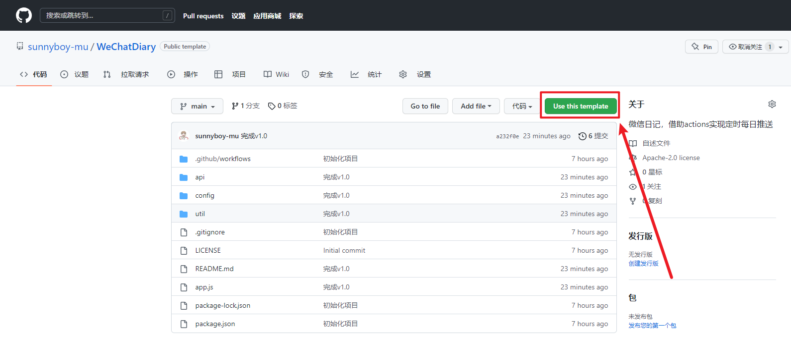

>   点击`Use this template`
>
>   输入`仓库名称`、`描述`

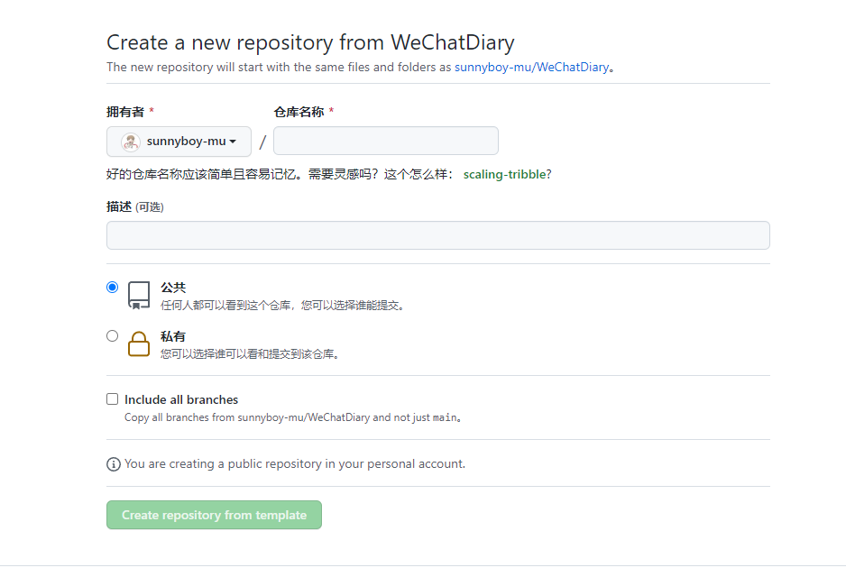

## 02、注册微信测试号

>   注册地址：https://mp.weixin.qq.com/debug/cgi-bin/sandbox?t=sandbox/login

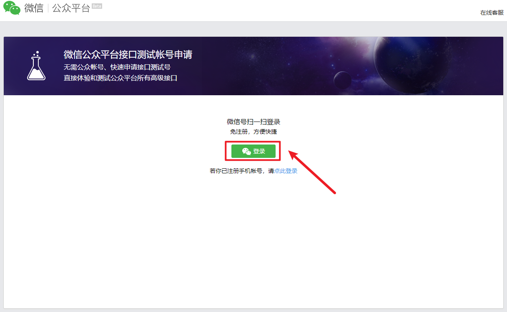

>   微信扫码登录即可注册成功

## 03、添加微信号

>   让朋友扫描二维码关注公众号

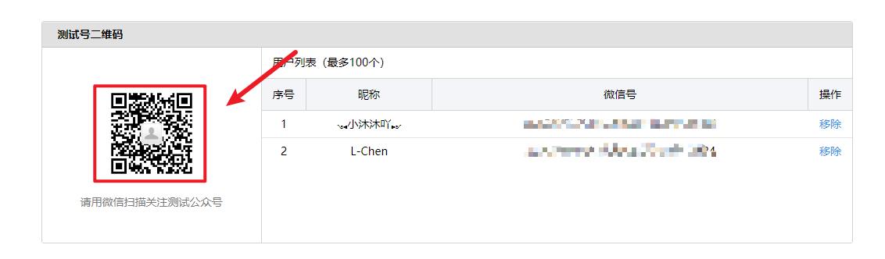

## 04、创建模板消息

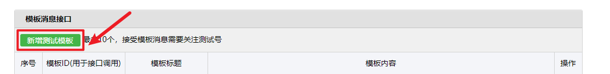

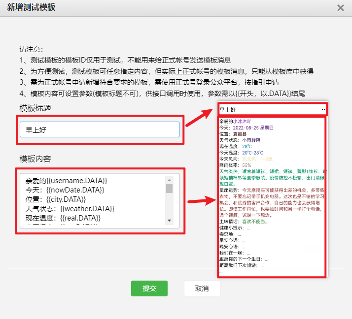

>   注意：参数不要选取太多，太多会造成内容显示不全，根据需求选取参数

**模板**

```
亲爱的{{username.DATA}}
今天：{{nowDate.DATA}}
所在城市：{{city.DATA}}
天气状态：{{weather.DATA}}
现在温度：{{real.DATA}}
今天温度：{{est.DATA}}
今天风向：{{wind.DATA}}
降雨概率：{{pop.DATA}}
穿戴建议：{{tips.DATA}}
星座运势：{{astro.DATA}}
土味情话：{{saylove.DATA}}
健康小提示：{{healthtip.DATA}}
毒鸡汤：{{duJiTang.DATA}}
早安心语：{{zaoAn.DATA}}
晚安心语：{{wanAn.DATA}}
我们在一起：{{togetherDays.DATA}}
距离你的下一个生日：{{birthday.DATA}}
距离我们下次旅游：{{tourism.DATA}}
彩虹屁：{{caiHongPi.DATA}}
```

## 05、参数一览表

|  功能模块  |      参数      |             说明              |
| :--------: | :------------: | :---------------------------: |
|    基础    |   `username`   |       朋友的名称或昵称        |
|            |   `nowDate`    | 现在时间，格式：年-月-日 星期 |
|            |     `city`     |     所在城市，支持市县区      |
|            | `togetherDays` |         在一起的天数          |
|            |   `birthday`   |     距离下一个生日的天数      |
|            |   `tourism`    |        计划旅游的天数         |
|    天气    |   `weather`    |           天气状态            |
|            |     `real`     |           现在温度            |
|            |     `est`      |           今天温度            |
|            |     `wind`     |           今天风向            |
|            |     `pop`      |           降雨概率            |
|            |     `tips`     |           穿戴建议            |
|  星座运势  |    `astro`     |           星座运势            |
|  土味情话  |   `saylove`    |           土味情话            |
| 健康小提示 |  `healthtip`   |          健康小提示           |
|   毒鸡汤   |   `duJiTang`   |            毒鸡汤             |
|  早安心语  |    `zaoAn`     |           早安心语            |
|  晚安心语  |    `wanAn`     |           晚安心语            |
|   彩虹屁   |  `caiHongPi`   |            彩虹屁             |

## 06、注册API接口

>   注册地址：https://www.tianapi.com/
>
>   注册登录后完成邮箱验证

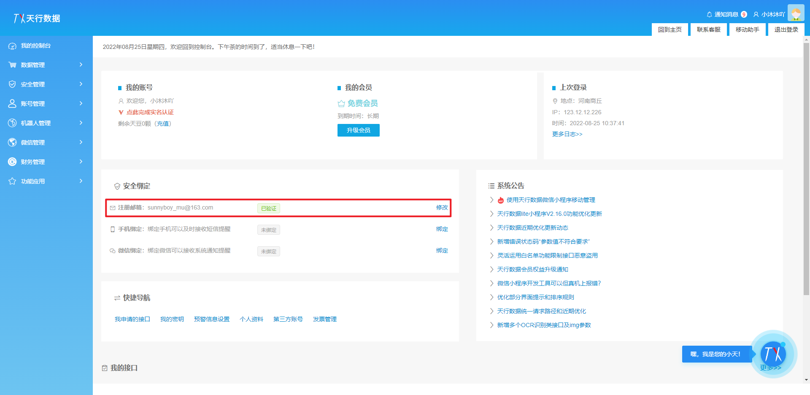

>   依次申请如下接口

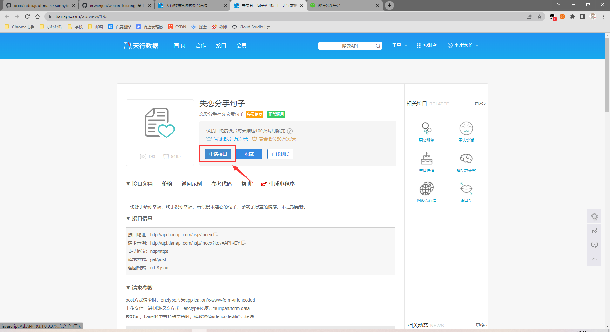

-   天气预报：https://www.tianapi.com/apiview/72
-   星座运势：https://www.tianapi.com/apiview/78
-   土味情话：https://www.tianapi.com/apiview/80
-   健康小提示：https://www.tianapi.com/apiview/122
-   毒鸡汤：https://www.tianapi.com/apiview/130
-   早安心语：https://www.tianapi.com/apiview/143
-   晚安心语：https://www.tianapi.com/apiview/142
-   彩虹屁：https://www.tianapi.com/apiview/181

## 07、配置项目参数

>   打开文件`config/index.js`并进入编辑模式

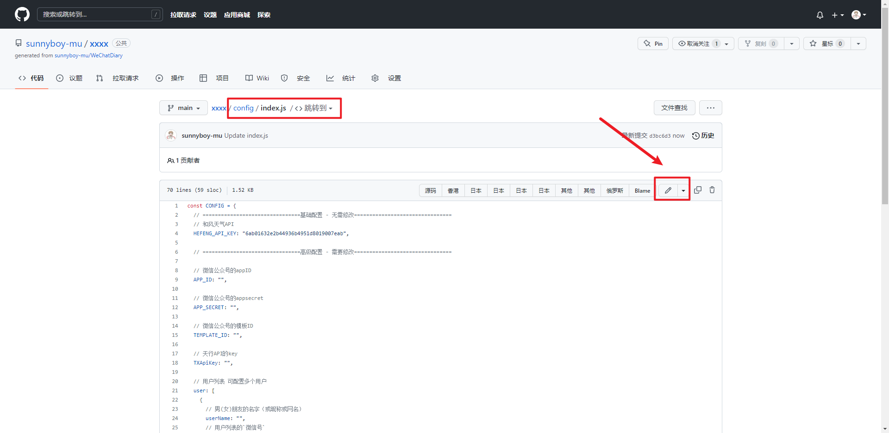

### 1、填写公众号配置

>   `APP_ID`和`APP_SECRET`

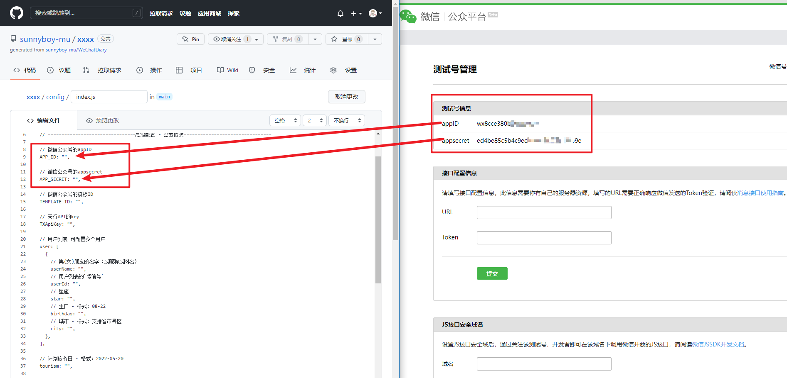

>   `模板id`

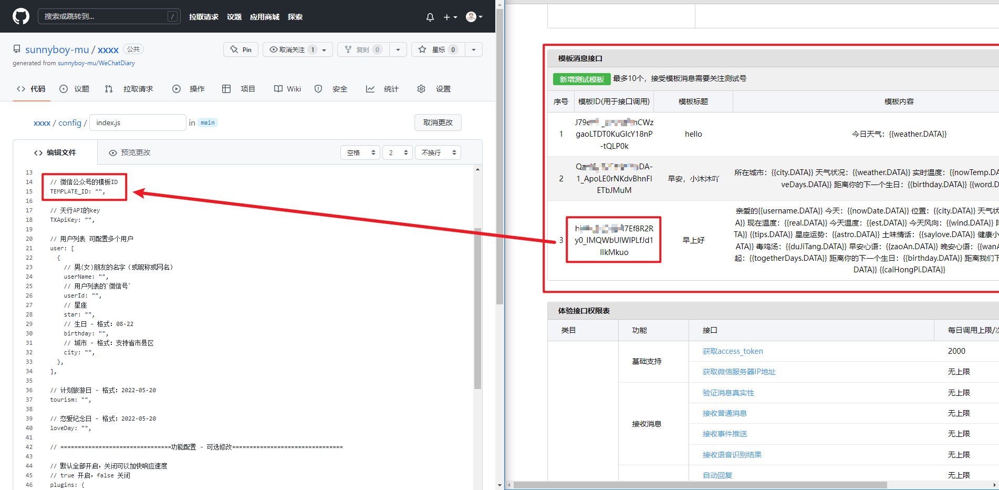

>   `用户信息`

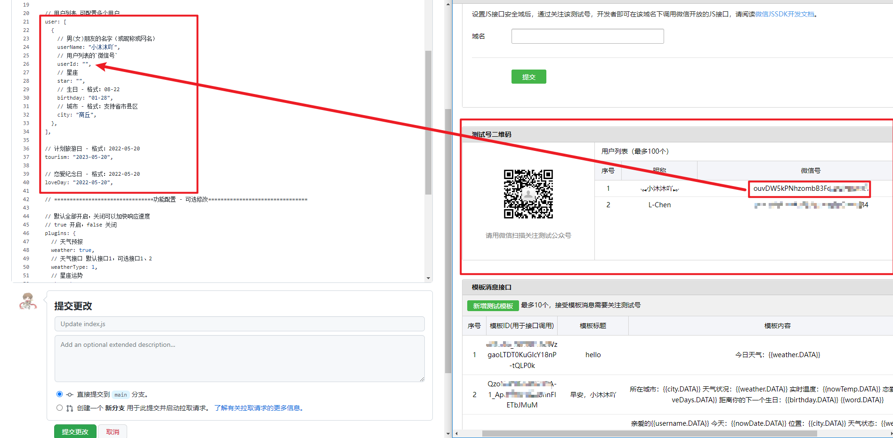

>   `计划旅游日`和`恋爱纪念日`自行填写

### 2、填写API接口配置

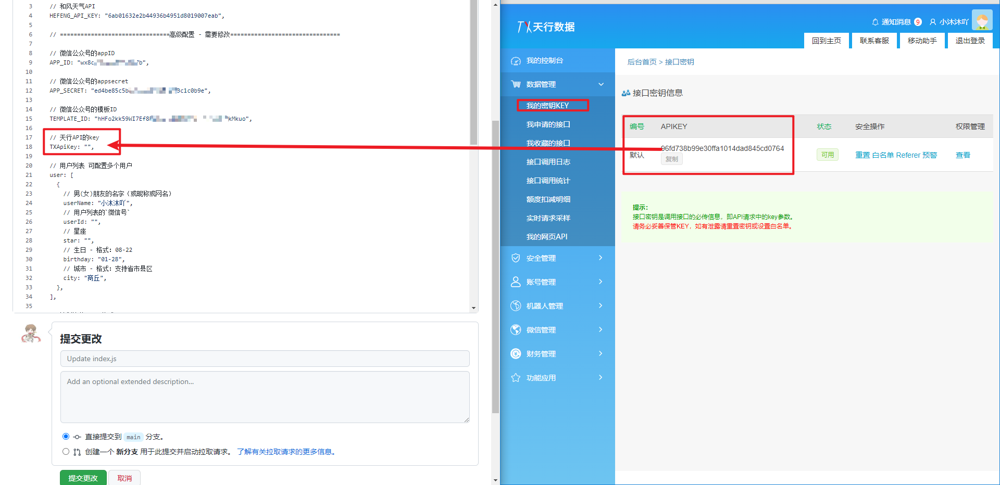

### 3、拓展-配置多用户

```
// 用户列表 可配置多个用户
  user: [
    {
      // 男(女)朋友的名字（或昵称或网名）
      userName: "小沐沐吖",
      // 用户列表的`微信号`
      userId: "用户1",
      // 星座
      star: "",
      // 生日 - 格式：08-22
      birthday: "01-28",
      // 城市 - 格式：支持省市县区
      city: "商丘",
    },{
      // 男(女)朋友的名字（或昵称或网名）
      userName: "小沐沐吖",
      // 用户列表的`微信号`
      userId: "用户1",
      // 星座
      star: "",
      // 生日 - 格式：08-22
      birthday: "01-28",
      // 城市 - 格式：支持省市县区
      city: "商丘",
    },
  ],
```

## 08、测试

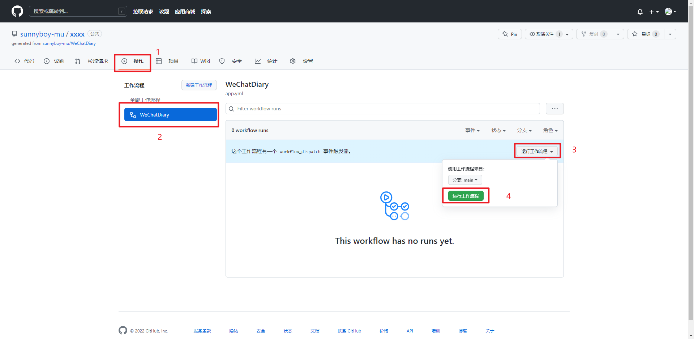


# 优化配置

**高级设置，不会配置请不要配置**

>   通过配置`config/index.js`的`plugins`来管理是否发送请求API
>
>   优化没有使用的API，加快响应速度

```js
// ================================功能配置 - 可选修改================================

  // 默认全部开启，关闭可以加快响应速度
  // true 开启，false 关闭
  plugins: {
    // 天气预报
    weather: true,
    // 天气接口 默认接口1，可选接口1、2
    weatherType: 1,
    // 星座运势
    star: true,
    // 土味情话
    saylove: true,
    // 健康小提示
    healthtip: true,
    // 毒鸡汤
    duJiTang: true,
    // 早安心语
    zaoAn: true,
    // 晚安心语
    wanAn: true,
    // 彩虹屁
    caiHongPi: true,
  },
};
```

>   注：天气API接口存在次数限制，暂时不做优化，如需优化，请提交`issues`

# 赞助

开源不易，如果本教程对你有帮助，可以考虑给作者`捐款`，激励作者继续更新迭代，感谢支持


